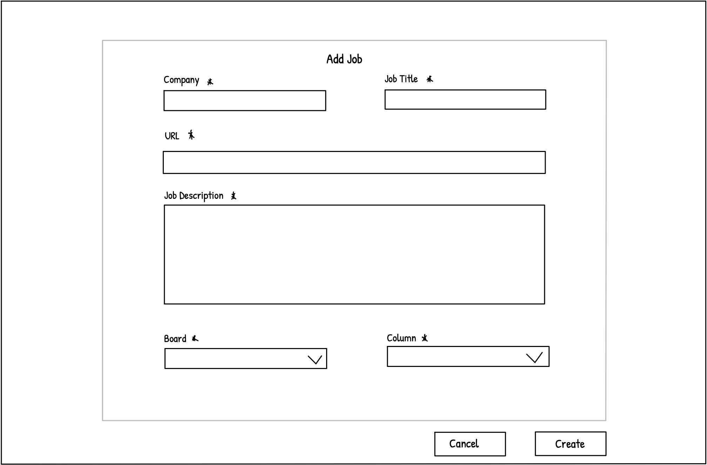
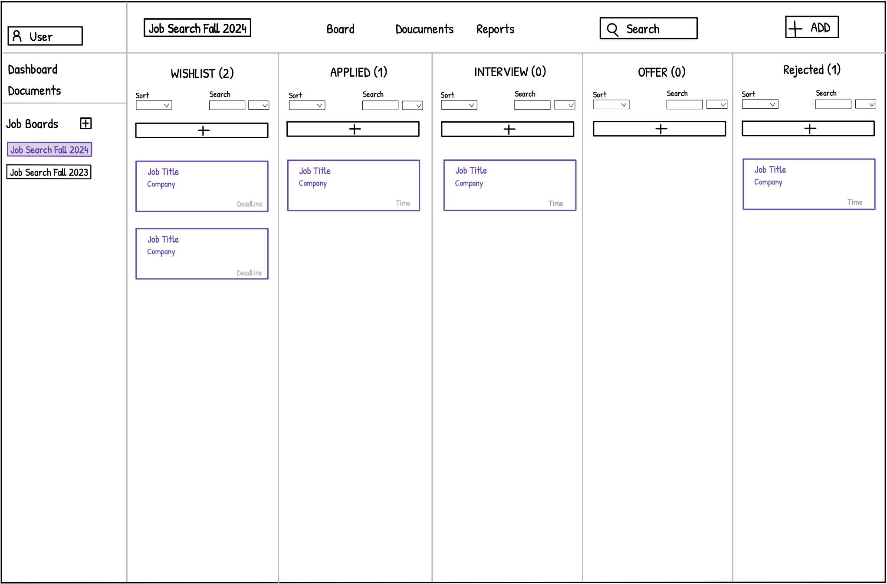
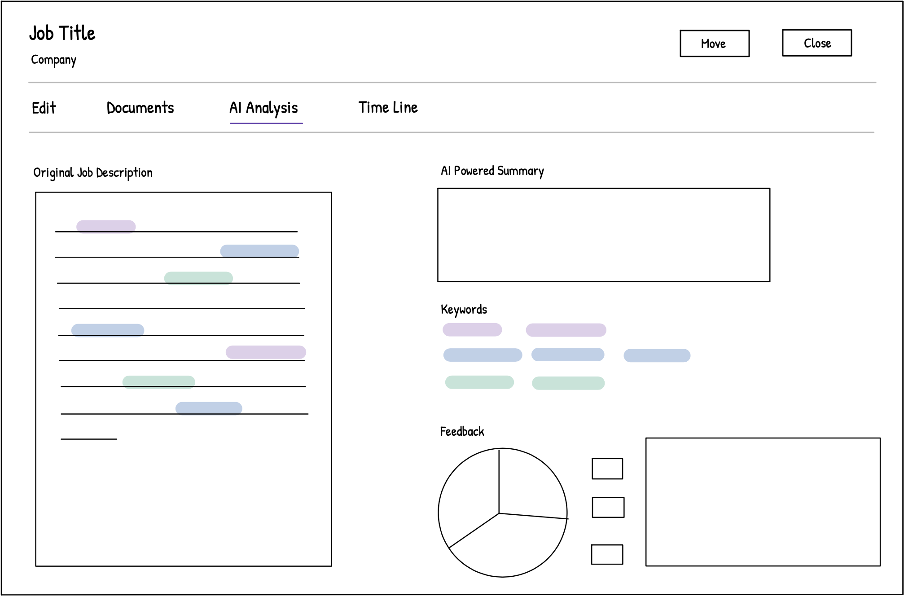

# Group 7 - JoBlog

#### 2024 Summer UBC CPSC 455 Group Project

💡 _**JoBlog** is a comprehensive job application management app designed to streamline the job search process for job
seekers. With features like a kanban-style job board, document storage, and AI-powered job description scraping and
keyword extraction, JoBlog helps users efficiently track and manage their job applications all in one place._

## Team Members

- Carol Ma - UBC 3rd year CS student
- Miranda Tang - UBC BCS student, Scrooge McDuck's hardcore fan
- Jia Jun Liu - UBC 3rd year CS student, cat fancier

## Project Description

**JoBlog** is a job application management app designed for job seekers who want to centralize and organize their job
search. It allows users to add, track, and manage job applications, record job details, and store resumes and cover
letters all in one place. With its intuitive kanban-style job board, users can effortlessly update the status of their
applications via drag-and-drop. Stretch features comprise a security check when resetting the password, producing
insightful reports on application statistics, and incorporating AI for resume and job description analysis.

## Project Task Requirements

### Minimal Requirements

- ✅ Users can register for an account, log in, and log out.
- ✅ Users can add/update/delete job applications, and record various details about the job (title, description, company
  name, location, etc).
- ✅ Users can view their job applications on a kanban-style job board, organized by status columns (applied, interview,
  offer, etc).

### Standard Requirements

- ✅ Users can update the status of a job application by dragging and dropping it between different columns on the job
  board.
- ✅ Users can sort, filter, or search through their job applications.
- ✅ Users can create multiple job boards (e.g. organize job applications by year).
- ✅ Users can upload and download application-related documents, such as resumes and cover letters.
- ✅ Users can interact with the app effortlessly across various screen sizes (i.e., responsive UI).

### Stretch Requirements

- ✅ Users can utilize generative AI to scrape job descriptions from websites and extract keywords from them.
- ✅ Users can reset their passwords by answering the security question they set up during registration.
- ✅ Users can view reports on their job application statistics including job post counts, application trends, and word
  clouds.

## Description of Technology Usage

1. **HTML, CSS, JavaScript & TypeScript**: This project employs HTML to structure the webpages, as illustrated in
   the `frontend/index.html` file, providing the foundational elements for the web application. Customized CSS, along
   with Tailwind CSS and the Ant Design UI library, are employed for styling, ensuring a responsive and visually
   appealing user interface. JavaScript is extensively used in the frontend
   for asynchronous operations, slice definitions, and configurations; TypeScript, a superset of JavaScript, is employed
   throughout the backend for type safety, model definitions, and error handling, thereby enhancing code quality and
   maintainability.
2. **React**: React is utilized to construct all the pages by building components, as indicated by
   the `frontend/src/components` and `frontend/src/pages` directory. React's component-based architecture enables the
   creation of reusable UI elements, promoting code reusability and modularity. The project employs hooks to manage
   state within the components and leverages React Router for handling routing of the webpage.
3. **Redux**: The project makes use of Redux Toolkit to define slices for different parts of the state,
   such as `authSlice`, `jobBoardsSlice`, `mobileSlice`, `sidebarSlice`, `themeSlice`, and `aiSlice` located in
   the `frontend/src/slices` folder. These slices define reducers and actions for managing authentication, job boards
   data, sidebar state, theme state, mobile state, and API interactions. Additionally, the project utilizes `rtk-query`
   for efficient data fetching and caching, as found in the `frontend/src/slices/api` folder.
4. **NodeJS & Express**: NodeJS is utilized for the backend server, facilitating efficient management of asynchronous
   operations
   and real-time data. The project employs Express for routing and middleware, as illustrated in
   the `backend/src/App.ts`, which demonstrates the application of abstract service patterns for business logic. The
   backend is structured into separate layers, including controllers, services, and repositories, fostering a clean and
   maintainable codebase.
5. **MongoDB**: MongoDB is used as the database for storing user information, job applications, job boards, and
   documents. The project
   employs Mongoose for object modeling and data validation, as seen in the `backend/src/models` directory. The
   application utilizes MongoDB Atlas for cloud-based database hosting, ensuring scalability, reliability, and
   performance.
6. **Release Engineering**: The project includes deployment workflows, as seen in `.github/workflows/deploy.yml`.
   Automated
   deployment pipelines ensure continuous integration and delivery, allowing for seamless updates and reliable
   production releases. Secrets are stored in `.env` files and imported into the Render deployment environment,
   enhancing security and simplifying configuration management.

## Above and Beyond

### Advanced Features

1. **Pretty UI**

    - **Smooth Drag and Drop Experience**: The kanban-style job board offers a seamless drag-and-drop experience,
      allowing users to effortlessly update the status of their job applications. The intuitive interface ensures that
      users can move job cards between columns with ease, providing a fluid and responsive interaction.

2. **Search Functionality**

    - **Advanced Search**: Users can search through their job applications with ease. The search functionality allows
      users to quickly find specific job posts. The kanban board reflects the search results swiftly, and users can
      view, move or edit job postings during the search, making the job search process more efficient and interactive.

3. **Insightful Reports**

    - **Comprehensive Analytics**: Users can view detailed reports on their job application statistics, including job
      post counts, application trends, and word clouds. These insightful reports are generated using the VChart
      component in the `BoardReports` module, providing users with valuable data to track their job search progress and
      identify patterns.

4. **Document Management**

    - **Upload and Download Documents**: The project includes a comprehensive document management system that allows
      users to upload and download application-related documents, such as resumes and cover letters. Leveraging AWS S3
      for secure and scalable storage, this feature ensures that all necessary documents are stored in one place, making
      it easy for users to manage and access their application materials.

5. **AI and Machine Learning**

    - **AI-Powered Job Description Scraping and Keyword Extraction**: The project leverages AI to scrape job
      descriptions from websites and extract relevant keywords such as role, company, location, description and
      requirements. This
      advanced feature helps users by automatically filling in these fields, saving effort and ensuring that job details
      are accurately captured.

6. **Security Features**

    - **JWT Token Authentication**: The project employs JSON Web Tokens (JWT) for secure authentication and
      authorization. This robust security measure ensures that user data is protected and only accessible to
      authenticated users, providing a secure environment for managing sensitive information.
    - **Password Reset with Security Questions**: Users can reset their passwords by answering a security question they
      set up during registration. This additional layer of security helps protect user accounts from unauthorized
      access, ensuring that only the rightful owner can reset their password.

7. **Time Zone Support**

    - **Multiple Time Zone Support**: The project is built with multi-timezone support. All time data is standardized by
      storing it in UTC format within the database, ensuring accurate deadline tracking independent of the user's local
      time zone. On the frontend, time data is automatically converted to the user’s local timezone, providing
      consistent and correct deadline displays for users globally. This approach ensures a reliable and uniform
      experience for users worldwide, making the application globally accessible and efficient.

8. **Design Pattern**
    - **MVC Design Pattern in Backend Development**: The backend effectively separates the application's data model,
      user interface, and business logic, allowing for further development and updates without impacting the others.
      Utilizing abstraction helps reduce code redundancy while enhancing efficiency and enabling individual testing of
      components. This results in more robust and reliable applications.

## Description of Next Steps

### 1. Provide More Login Methods

- **Goal**: Enhance user convenience by allowing login through various methods, including Google accounts.
- **Implementation**: Integrate OAuth 2.0 for Google login using libraries like `passport-google-oauth20`.

### 2. Automatically Pull Down Expired Job Posts

- **Goal**: Ensure job posts that are past their expiry date are automatically removed from the active job board.
- **Implementation**: Implement a scheduled task to check for expired job posts and update their status.

### 3. AI Analysis of Resume Compared with Job Description

- **Goal**: Provide users with insights on how well their resume matches a job description.
- **Implementation**: Analyze and compare resumes with job descriptions using LLM models or other NLP techniques.

## List of contributions

### Carol Ma

- Led the frontend development, establishing an infrastructure with React, Redux, React Router, and Tailwind CSS, and
  created a responsive, feature-rich UI including a Kanban-style job board, a navbar for each board, a sidebar for the
  entire website, a landing page, a documents system, dynamic dashboards/reports, dark/light mode settings, and user
  authentication pages.
- Integrated RTK Query for seamless backend connectivity, implemented advanced search
  functionality and designed an AI-assisted job detail addition workflow to enhance user interaction and data accuracy.
- Conducted research on using the OpenAI API for job description parsing, developed a scraper for URL-based
  data extraction, and engineered retry mechanisms to optimize the extraction process.

### Miranda Tang

- Collaborated with teammates to design the database schema.
- Developed the reporting feature to showcase job application statistics.
- Leveraged OpenAI's function calling to extract job descriptions.
- Performed testing on both frontend and backend functionalities, and was accountable for functionality
  demonstrations and document preparation.

### Jia Jun Liu

- Set up backend infrastructure and designed the database.
- Researched and implemented Mongoose, MongoDB APIs, and AWS S3 services.
- Developed user authentication and authorization using JWT tokens.
- Set up GitHub Actions and deployed both frontend and backend on Render.

## Project Demo

🎬 Please click [here](https://www.youtube.com/watch?v=8XdOeo-SZj4) to view the demo of our project.

## Sketch Prototype of Key Tasks

### Add Job Modal

### Progress of Job Applications

### AI Analysis for a Single Job Application

# Disclaimer

This repository is provided solely for technical demonstration and educational purposes as part of personal portfolio work. It is not intended for redistribution, commercial use, or as an official distribution of any software used by AWS or affiliated organizations. 

Please note that while the project code is licensed under the [MIT License](LICENSE), this repository and the material contained within are specifically intended to showcase the technical skills of the author for use in interviews, resumes, or similar professional evaluations.

The original copyright remains with **Team BeyondScope** and contributors.
